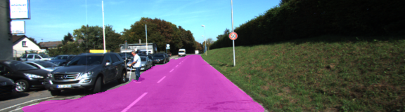
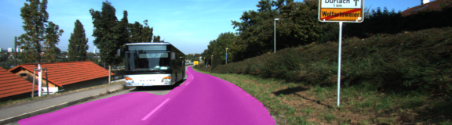
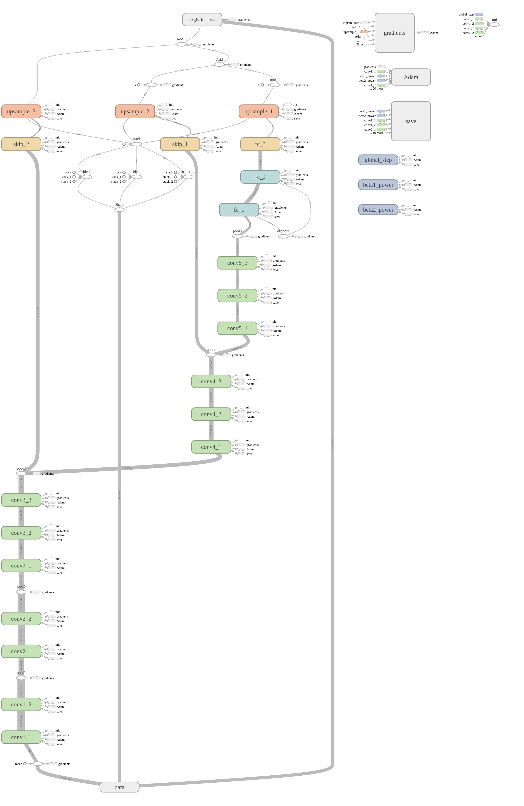
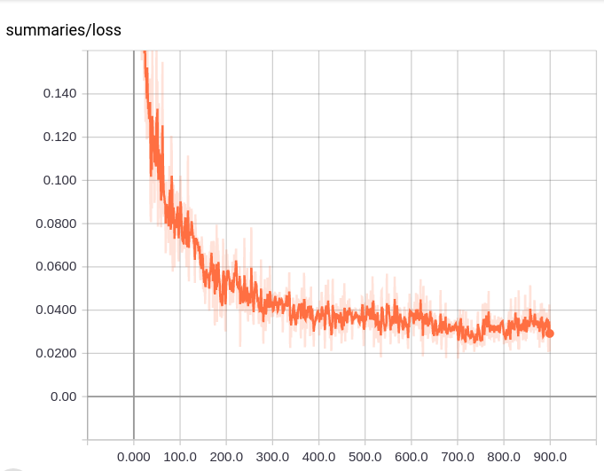

# Semantic Segmentation using a Fully Convolutional Neural Network

### Introduction
This repository contains a set of python scripts to train and test semantic segmentation using a fully convolutional neural network. The semantic segmentation network is based on the [paper](https://people.eecs.berkeley.edu/~jonlong/long_shelhamer_fcn.pdf) described by Jonathan Long et al.

#### How to Train the Model
1. Since the network uses VGG-16 weights, first, you have to download VGG-16 pre-trained weights from [https://www.cs.toronto.edu/~frossard/vgg16/vgg16_weights.npz](https://www.cs.toronto.edu/~frossard/vgg16/vgg16_weights.npz) and save in the the `pretrained_weights` folder.
2. Download [KITTI dataset](http://www.cvlibs.net/datasets/kitti/eval_road.php) and save it in the `data/data_road` folder.
3. Next, open a command window and type `python fcn.py` and hit the enter key.

Please note that training checkpointing will be saved to `checkpoints/kitti` folder and logs will be saved to `graphs/kitti` folder. So by using `tensorboard --logdir=graphs/kitti` command, you can start tensorboard to inspect the training process.

Following images show sample output we obtained with the trained model.

### Network Architecture

We implement the `FCN-8s` model described in the [paper](https://people.eecs.berkeley.edu/~jonlong/long_shelhamer_fcn.pdf) by Jonathan Long et al. Following figure shows the architecture of the network. We generated this figure using TensorBoard.

Additionally, we would like to describe main functionalities of the `python` scripts of this repository in the following table.

|Script |Description|
|:------|:----------|
|`fcn.py`|This is the main script of the repository. The key methods of this script are:`build`, `optimize` and `inference`. The `build` method load pre-trained weights and build the network. The `optimize` method does the training and `inference` is used for testing with new images.|
|`loss.py`|The script contains the loss function we optimize during the training.|
|`helper.py`|This script contains some useful utility function for generating training and testing batches.|
|`model_utils.py`|This script contains some useful utility functions to building fully convolutional network using VGG-16 pre-trained weights.|

### The KITTI dataset

For training the semantic segmentation network, we used the [KITTI dataset](http://www.cvlibs.net/datasets/kitti/eval_road.php). The dataset consists of 289 training and 290 test images. It contains three different categories of road scenes:

* uu - urban unmarked (98/100)
* um - urban marked (95/96)
* umm - urban multiple marked lanes (96/94)

### Training the Model

When it comes to training any deep learning algorithm, selecting suitable hyper-parameters play a big role. For this project, we carefully select following hyper-parameters

|Parameter |Value  |Description|
|:---------|:------|:----------|
|Learning Rate|1e-5|We used `Adam` optimizer and normally 1e-3 or 1e-4 is the suggested learning rate. However, when we were experimenting with different learning rates we found out that 1e-5 works better than above values.|
|Number of epochs|25|The training dataset is not too big and it has only 289 training examples. Hence, we use a moderate number of epochs.|
|Batch Size|8|Based on the size of the training dataset, we selected batch size of 8 images.|

The following image shows how the training loss changes when we train the model.

### Conclusiotn

In this project, we investigated how to use a fully convolutional neural network for semantic segmentation. We tested our model against KITTI dataset. The results indicate that our model is quite capable of separating road pixels form the rest. However, we would like to work on following additional ta to increase the accuracy of our model.
1. Data Augmentation: During our testing, we have found that our mode failed to label road surface when inadequate lighting in the environment. We think data augmentation can be used to generate more training examples with different lighting conditions. So additional data generated using data augmentation will help us to overcome the above-mentioned issue.
  

